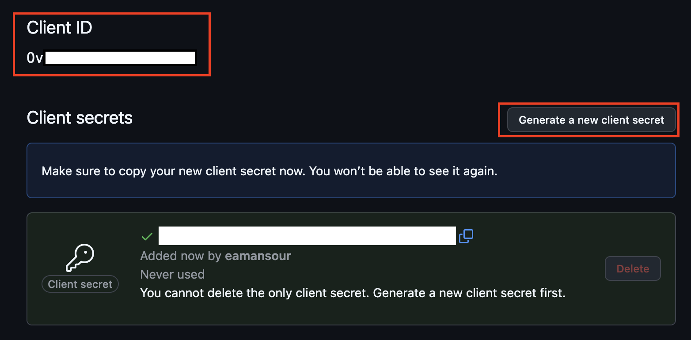

# Introduction

Galasa provides Helm charts to install various components, the main one being a Galasa Ecosystem.

## Prerequisites

[Helm](https://helm.sh) must be installed to use the charts.  Please refer to
Helm's [documentation](https://helm.sh/docs) to get started.

## Contents
### [Galasa Ecosystem Chart](#galasa-ecosystem-chart-1)
- [Kubernetes RBAC setup](#kubernetes-rbac-setup)
- [Installing the Ecosystem chart on a remote Kubernetes cluster](#installing-the-ecosystem-chart-on-a-remote-kubernetes-cluster)
  - [Configuring Ingress](#configuring-ingress)
  - [Configuring Dex](#configuring-dex)
  - [Configuring your Kafka cluster to use the Galasa Kafka extension (Optional)](#configuring-your-kafka-cluster-to-use-the-galasa-kafka-extension-optional)
  - [Installing your Galasa Ecosystem](#installing-your-galasa-ecosystem)
- [Verifying your Galasa Ecosystem Installation](#verifying-your-galasa-ecosystem-installation)
  - [Accessing services](#accessing-services)
- [Upgrading the Galasa Ecosystem](#upgrading-the-galasa-ecosystem)
- [Uninstalling the Galasa Ecosystem](#uninstalling-the-galasa-ecosystem)
- [Rotating Encryption Keys](#rotating-encryption-keys)
  - [Prerequisites](#prerequisites-1)
  - [Automated steps](#automated-steps)
  - [Manual steps](#manual-steps)
- [Installing the Ecosystem chart on Minikube](#installing-the-ecosystem-chart-on-minikube)
    - [Linux](#linux)
    - [macOS](#macos)
- [Development](#development)

## Galasa Ecosystem chart
### Kubernetes RBAC setup
If RBAC is active on your Kubernetes cluster, you will need to get your Kubernetes administrator to replace the [placeholder username](https://github.com/galasa-dev/helm/blob/main/charts/ecosystem/rbac-admin.yaml#L39) in the [rbac-admin.yaml](./charts/ecosystem/rbac-admin.yaml) file with a username corresponding to a user with access to your cluster to assign them the `galasa-admin` role. This role allows assigned users to run the helm install/upgrade/delete commands to interact with the helm chart.

If multiple users require admin privileges, multiple groups, users, or ServiceAccounts can be assigned the `galasa-admin` role by extending the [subjects](https://github.com/galasa-dev/helm/blob/main/charts/ecosystem/rbac-admin.yaml#L36) list (see [Using RBAC Authorization](https://kubernetes.io/docs/reference/access-authn-authz/rbac) for more information).

For chart versions following 0.23.0, the other RBAC file ([rbac.yaml](./charts/ecosystem/templates/rbac.yaml)) is applied automatically when installing the ecosystem chart. It creates a Galasa service account if one does not already exist so the API, Engine Controller, Metrics, and Resource Monitor can coordinate, while allowing the Engine Controller to create and manage engine pods.

For chart version 0.23.0 and prior, you will need to apply [rbac.yaml](./charts/ecosystem/rbac.yaml) manually. You can do this by running the following command:
```console
kubectl apply -f https://raw.githubusercontent.com/galasa-dev/helm/ecosystem-0.23.0/charts/ecosystem/rbac.yaml
```

### Installing the Ecosystem chart on a remote Kubernetes cluster
First, add the galasa repository as follows:

```console
helm repo add galasa https://galasa-dev.github.io/helm
```

If you have already added this repository earlier, run `helm repo update` to retrieve
the latest versions of the packages. You can then run `helm search repo galasa` to see the available charts.

Note: The Galasa Ecosystem Helm chart will deploy three persistent volumes. If you need to provide a Kubernetes storage class for these PVs, update the `storageClass` value in your [values.yaml](./charts/ecosystem/values.yaml) file with the name of a valid StorageClass on your cluster.

Download the [values.yaml](charts/ecosystem/values.yaml) file and within it:

  1. Set the `galasaVersion` value to a version of galasa you want to run (see [releases](https://galasa.dev/releases) for released versions). You should not use latest to ensure each pod in the Ecosystem is running at the same level.
  2. Set the `externalHostname` value to the hostname that will be used to access Galasa services. 

Once you have updated the `galasaVersion` and `externalHostname` values, continue following the instructions below to set up Ingress and Dex for your ecosystem.

#### Configuring Ingress

The ecosystem chart uses Ingress to reach services running within a Kubernetes cluster. See the [Kubernetes documentation](https://kubernetes.io/docs/concepts/services-networking/ingress) to learn more about Ingress.

Assuming your Ingress controller has been set up on your Kubernetes cluster, update the values under the `ingress` section within your values.yaml file as follows to configure the use of Ingress in your ecosystem:

1. Replace the `ingressClassName` value with the name of the IngressClass that is configured in your cluster. By default, `nginx` is used.

2. If you are using HTTPS, add a `tls` configuration within the `ingress` section, specifying the `hosts` list and a `secretName` value corresponding to the name of the Kubernetes Secret that contains your TLS private key and certificate. See the [Kubernetes documentation](https://kubernetes.io/docs/concepts/services-networking/ingress/#tls) for information for how to set up TLS.

#### Configuring Dex
As of Galasa version 0.32.0, [Dex](https://dexidp.io) is used to authenticate users attempting to interact with a Galasa Ecosystem.

To configure Dex in your ecosystem, update your values.yaml file according to the following steps:

1. Replace the hostname in your `issuer` value with the same hostname given in `externalHostname` and set the URI scheme to either `http` or `https`. For example:

    ```yaml
    issuer: http://<your-external-hostname>/dex
    ```

2. If desired, update the `expiry` section to configure the expiry of JSON Web Tokens (JWTs) and refresh tokens issued by Dex. By default, JWTs expire 24 hours after being issued and refresh tokens remain valid unless they have not been used for one year. See the Dex's documentation on [ID tokens](https://dexidp.io/docs/id-tokens) for information and available expiry settings.

Next, you will need to configure Dex to authenticate via a connector to authenticate with an upstream identity provider like GitHub, Microsoft, or an LDAP server. For a full list of supported connectors, refer to the [Dex documentation](https://dexidp.io/docs/connectors). In this guide, we will configure Dex to authenticate through GitHub:

1. Register an OAuth application in [GitHub](https://github.com/settings/applications/new), ensuring the application's callback URL is set to your Dex `issuer` value followed by `/callback`. For example, if your `issuer` value is `https://example.com/dex`, then your callback URL would be `https://example.com/dex/callback`. The application's homepage URL should be set to your external hostname. See below for an example OAuth app configuration, where `example.com` is being used as the `externalHostname` value:

    

2. Generate a new client secret for the OAuth application by pressing the "Generate a new client secret" button, then copy both the client ID and the generated client secret:

    

4. Add a GitHub connector to your Dex configuration, providing the name of your GitHub organisation and any teams that you require users to be part of to be able to use your ecosystem as follows:

    ```yaml
    dex:
      config:
        # Other Dex configuration values...

        connectors:
        - type: github
          id: github
          name: GitHub
          config:
            clientID: $GITHUB_CLIENT_ID
            clientSecret: $GITHUB_CLIENT_SECRET
            redirectURI: <your-dex-issuer-url>/callback
            orgs:
            - name: my-org
              teams:
              - my-team
    ```
    where `$GITHUB_CLIENT_ID` and `$GITHUB_CLIENT_SECRET` correspond to the registered OAuth application's client ID and secret. Also ensure that the `redirectURI` value is the same value that you provided when setting up your GitHub OAuth application in step 1.

    If you would like to pull the client ID and secret values of your OAuth application from a Kubernetes Secret, create a Secret by running the following `kubectl` command, ensuring the Secret's keys match those given in the GitHub connector's `clientID` and `clientSecret` values without the leading `$` (i.e. `GITHUB_CLIENT_ID` and `GITHUB_CLIENT_SECRET` in the following example):

    ```bash
    kubectl create secret generic my-github-oauth-app-credentials \
    --from-literal=GITHUB_CLIENT_ID="myclientid" \
    --from-literal=GITHUB_CLIENT_SECRET="myclientsecret"
    ```

    Once your Kubernetes Secret has been created, you can supply the name of the Secret using the `envFrom` value in your values.yaml file to mount the Secret as follows:

    ```yaml
    dex:
      envFrom:
        - secretRef:
          name: my-github-oauth-app-credentials

      config:
        # Other Dex configuration values...

        connectors:
        - type: github
          id: github
          name: GitHub
          config:
            clientID: $GITHUB_CLIENT_ID
            clientSecret: $GITHUB_CLIENT_SECRET
            redirectURI: <your-dex-issuer-url>/callback
            orgs:
            - name: my-org
              teams:
              - my-team
    ```

By default, the Galasa Ecosystem Helm chart will create a Kubernetes Secret containing configuration details for Dex. If you would like to apply your own Dex configuration as a Secret, your Dex configuration must be provided in a `config.yaml` key within the Secret and the value of the `config.yaml` key must be a valid Dex configuration.

For more information on configuring Dex, refer to the [Dex documentation](https://dexidp.io/docs).

#### Configuring your Kafka cluster to use the Galasa Kafka extension (Optional)

Galasa now provides a Kafka extension which can publish events from Galasa to topics in a configured Kafka cluster. This is optional and must be explicitly opted into. Please see the [Kafka extension documentation](https://github.com/galasa-dev/extensions/blob/main/galasa-extensions-parent/dev.galasa.events.kafka/README.md) for more details.

If you wish to produce events from Galasa to a Kafka cluster, you must create a service credential token with write access to topics in the cluster, and provide it to your ecosystem Helm chart via a Secret called 'event-streams-token'.

1. Create the 'event-streams-token' Secret in the namespace your ecosystem will be installed in the following format:
```yaml
apiVersion: v1
kind: Secret
metadata:
  name: event-streams-token
data:
  GALASA_EVENT_STREAMS_TOKEN: <yourtoken>
```

When the chart is installed, it will check for existence of the Secret, and provide the token as an environment variable to the Pods that will require it to authenticate to your Kafka cluster.


#### Installing your Galasa Ecosystem

Having configured your [values.yaml](charts/ecosystem/values.yaml) file, use the following command to install the Galasa Ecosystem Helm chart:

```console
helm install -f /path/to/values.yaml <release-name> galasa/ecosystem --wait
```

where `/path/to/values.yaml` is the path to the `values.yaml` file that you downloaded, and `<release-name>` is the name that you want to give the ecosystem.

The `--wait` flag ensures the chart installation has completed before marking it as "Deployed". During the installation, the API pod waits for the etcd and RAS pods to initialise while the engine-controller, metrics, and resource-monitor pods wait for the API pod to initialise.

You can view the status of the deployed pods at any time by running `kubectl get pods` in another terminal. The results should look similar to the following:
```console
NAME                                      READY   STATUS     RESTARTS      AGE
test-api-7945f959dd-v8tbs                 1/1     Running    0             65s
test-dex-5dc7fcb55f-lqv6s                 1/1     Running    0             65s
test-engine-controller-56fb476f45-msj4x   0/1     Init:0/1   0             65s
test-etcd-0                               1/1     Running    0             65s
test-metrics-5fd9f687b6-rwcww             0/1     Init:0/1   0             65s
test-ras-0                                1/1     Running    0             65s
test-resource-monitor-778c647995-x75z9    0/1     Init:0/1   0             65s
test-webui-6c896974d8-2k2tk               1/1     Running    0             65s
```

### Verifying your Galasa Ecosystem Installation

After the `helm install` command ends with a successful deployment message, you can run the following command to ensure the Ecosystem can be accessed externally to Kubernetes and a simple test engine can be run:

```console
helm test <release-name>
```

where `<release-name>` is the name that you gave the ecosystem during installation.

Once the `helm test` command ends and displays a success message, the Ecosystem has been set up correctly and is ready to be used.

#### Accessing services

Using Ingress, the URL of the Ecosystem bootstrap will be your external hostname followed by `/api/bootstrap`.

For example, if the external hostname you provided was `example.com` and you have provided values for using TLS, the bootstrap URL would be `https://example.com/api/bootstrap`. This is the URL that you would enter into a galasactl command's `--bootstrap` option to interact with your ecosystem.

### Upgrading the Galasa Ecosystem

If you want to upgrade the Galasa Ecosystem to use a newer version of Galasa, for example, then you can use the following commands:

```console
helm repo update
helm upgrade <release-name> galasa/ecosystem --reuse-values --set galasaVersion=0.38.0 --wait
```

### Uninstalling the Galasa Ecosystem

To uninstall the Galasa Ecosystem, run the following command, replacing `<release-name>` with the release name provided when installing the Ecosystem Helm chart in the [Installing your Galasa Ecosystem](#installing-your-galasa-ecosystem) section:

```console
helm uninstall <release-name>
```

### Rotating Encryption Keys

To maintain the security of your Galasa Ecosystem, you may wish to replace the encryption key being used to encrypt credentials in the Galasa Ecosystem's credentials store with a new encryption key, and re-encrypt all your existing credentials using the new key.

When the Galasa Ecosystem Helm chart is installed, a Kubernetes Secret is created which contains the base64-encoded, 256-bit encryption keys used to encrypt credentials stored in the Galasa Ecosystem's credentials store using AES-256-GCM encryption.

The encryption keys are stored in the following YAML structure:
```yaml
encryptionKey: <base64-encoded-encryption-key>
fallbackDecryptionKeys:
- <base64-encoded-encryption-key>
- <base64-encoded-encryption-key>
```

The `encryptionKey` key in the YAML entry represents the active base64-encoded, 256-bit encryption key used to encrypt credentials stored in the Galasa Ecosystem's credentials store.

The `fallbackDecryptionKeys` list represents a list of base64-encoded encryption keys that are no longer in use, and allows for encryption keys to be rotated without losing previous encryption keys. This allows encrypted credentials to be decrypted with a fallback decryption key and then be encrypted using the newly activated encryption key.

**Before proceeding to rotate encryption keys, it is highly recommended to make a backup of the existing credentials stored in your Galasa Ecosystem by running the following command using the Galasa CLI tool:**

```console
galasactl secrets get --format yaml > /path/to/backup/file.yaml
```

**where `/path/to/backup/file.yaml` is either an absolute or relative path of your choice to a file where the backup will be stored.**

#### Prerequisites

The following command-line utilities must be installed:

- kubectl (v1.30.3 or later)
- galasactl (0.38.0 or later)
- openssl (3.3.2 or later)

You must have the correct permissions to read and update Kubernetes Secrets in the Kubernetes namespace that you have installed your Galasa Ecosystem within.

You must also have a valid personal access token for your Galasa Ecosystem set on your machine so that you can retrieve and update secrets with `galasactl`.

#### Automated steps

For Linux and macOS, you can download and run the [`rotate-encryption-keys.sh`](./rotate-encryption-keys.sh) script via the command-line to simplify the process of rotating encryption keys and re-encrypting credentials.

The following flags can be supplied when running the script:
- `--release-name <name>` **Required**. The helm release name provided when installing the Galasa Ecosystem helm chart
- `--namespace <namespace>` Optional. The Kubernetes namespace where your Galasa Ecosystem is installed
- `--bootstrap <bootstrap-url>` Optional. The bootstrap URL of the Galasa Ecosystem that is being serviced. Not required if the `GALASA_BOOTSTRAP` environment variable is set and is pointing to the correct bootstrap URL. Overrides the existing `GALASA_BOOTSTRAP` environment variable value if set

For example:

```console
./rotate-encryption-keys.sh --release-name example --namespace galasa-dev
```

The `rotate-encryption-keys.sh` script will automatically update the current encryption key with a new one, and then restart your Galasa Ecosystem's API and engine controller pods so that they can pick up the new encryption key. After rotating the encryption keys, the script will re-encrypt the existing secrets in your Galasa Ecosystem using the newly activated encryption key.

Once the encryption keys have been rotated and the existing secrets have been re-encrypted, the script will clear the fallback decryption keys list and restart the API and engine controller pods for a final time to keep the Galasa services in sync with the contents of the encryption keys secret.

#### Manual steps

If the `rotate-encryption-keys.sh` script fails or if you are on Windows and cannot run the script, you can manually rotate encryption keys by performing the following steps.

This guide assumes `kubectl` is configured to manage resources in the namespace that your Galasa Ecosystem is installed within, so the `--namespace` flag is not required when running `kubectl` commands.

This guide also assumes that the `GALASA_BOOTSTRAP` environment variable is set, so the `--bootstrap` flag is not required when running `galasactl` commands.

1. Get all the existing secrets from your Galasa Ecosystem by running:
   ```
   galasactl secrets get --format yaml
   ```
   Store these secrets in a `.yaml` or `.yml` file so that you can re-encrypt them after rotating the encryption keys

2. Find the name of the Kubernetes Secret containing your Galasa Ecosystem's encryption keys by running:
   ```
   kubectl get secrets
   ```
   The secret's name should be of the form `{release-name}-encryption-secret`, where `{release-name}` is the Helm release name provided when installing the Galasa Ecosystem Helm chart

3. Get the existing encryption keys data for your Galasa Ecosystem by running:
   ```
   kubectl get secret {encryption-secret-name} --output jsonpath='{ .data.encryption-keys\.yaml }' | openssl base64 -d -A
   ```
   where `{encryption-secret-name}` is the name of the Kubernetes secret retrieved in step 2. The output should look like the following:
   ```yaml
   encryptionKey: <existing-encryption-key>
   fallbackDecryptionKeys: []
   ```
   Place the output into a file

4. Generate a new encryption key by running:
   ```
   openssl rand -base64 32
   ```

5. In the file created at the end of step 3, move the existing `encryptionKey` value into the `fallbackDecryptionKeys` list and place the newly generated encryption key into the `encryptionKey` field. The file should now look like this:
   ```yaml
   encryptionKey: <newly-generated-encryption-key>
   fallbackDecryptionKeys:
   - <existing-encryption-key>
   ```
   where `<newly-generated-encryption-key>` is the new encryption key generated in step 5 and `<existing-encryption-key>` is the old encryption key retrieved in step 3

6. Base64-encode the file contents by running the following command, where `<encryption-keys-file>` is an absolute or relative path to the file created in step 3 (and modified in step 5):
   ```
   openssl base64 -in <encryption-keys-file>
   ```
   Record the base64-encoded output, making sure there are no spaces or line breaks in the recorded output

7. Update the existing Kubernetes Secret with the rotated keys by running:
   ```
   kubectl patch secret {encryption-secret-name} --type='json' -p="[{'op': 'replace', 'path': '/data/encryption-keys.yaml', 'value': '<base64-encoded-encryption-keys>'}]"
   ```
   where `{encryption-secret-name}` is the name of the Kubernetes secret retrieved in step 2, and `<base64-encoded-encryption-keys>` is the output recorded from step 6

8. Restart the Galasa Ecosystem's API server deployment by running:
    ```
    kubectl rollout restart deployment {release-name}-api
    kubectl rollout status deployment {release-name}-api
    ```
    where `{release-name}` is the name of the Helm release provided when installing the Galasa Ecosystem Helm chart

9. Restart the Galasa Ecosystem's engine controller deployment by running:
    ```
    kubectl rollout restart deployment {release-name}-engine-controller
    kubectl rollout status deployment {release-name}-engine-controller
    ```
    where `{release-name}` is the name of the Helm release provided when installing the Galasa Ecosystem Helm chart

10. Once both the API server and engine controller have been restarted successfully, you can re-encrypt your existing secrets using the YAML file you created in step 1, by running:
    ```
    galasactl resources apply -f <secrets-yaml-file>
    ```
    where `<secrets-yaml-file>` is an absolute or relative path to the YAML file created at the end of step 1

Your Galasa Ecosystem will now use the newly generated encryption key to encrypt and decrypt secrets until the next time it is rotated.

To verify that your secrets can still be read correctly, you can run `galasactl secrets get --format yaml` again and compare the YAML output with the content of YAML file that you applied in step 10. If the output is the same, then the secrets have been re-encrypted successfully.

### Installing the Ecosystem chart on Minikube

It is highly discouraged to use minikube for production purposes since it only provides a single Kubernetes node and will not scale well in demanding situations. Only use minikube for development and testing purposes.

If you would like to install the chart into minikube, ensure you have minikube [installed](https://minikube.sigs.k8s.io/docs/start/) and that it is running with `minikube status`. If minikube is not running, start it by running `minikube start`.

Once minikube is running, follow the instructions below to install the Galasa Ecosystem chart. Only follow the instructions that apply to your operating system.

#### Linux
1. Ensure the NGINX Ingress controller is enabled by running:
    
    ```console
    minikube addons enable ingress
    ```

2. Add an entry to your `/etc/hosts` file like the one shown below, ensuring the IP address matches the output of `minikube ip` and (optionally) replacing `example.com` with any hostname that you would like to access your Galasa service on locally:
      ```console
      # Replace 192.168.49.2 with the output of minikube ip
      192.168.49.2 example.com
      ```

3. Follow the installation instructions [above](#configuring-ingress) to update the rest of your values.yaml file, including values to configure Ingress and Dex.

4. Once you have updated your values.yaml file, run the following command, providing the path to the [`ecosystem`](./charts/ecosystem) directory in this repository (e.g. `~/helm/charts/ecosystem`).

    ```console
    helm install <release-name> /path/to/helm/charts/ecosystem
    ```

5. Once the `helm install` command ends with a successful deployment message, follow the installation instructions [above](#verifying-your-galasa-ecosystem-installation) to test the deployed ecosystem using `helm test` and determine the bootstrap URL.

#### macOS
1. Ensure the NGINX Ingress controller is enabled by running:
    
    ```console
    minikube addons enable ingress
    ```

2. Add an entry to your `/etc/hosts` file as shown below, (optionally) replacing `example.com` with any hostname that you would like to access your Galasa service on locally:

      ```
      127.0.0.1 example.com
      ```

3. Add an entry to minikube's CoreDNS ConfigMap so that deployed pods can resolve the external hostname internally:
    1. Run `minikube ip` and take a note of the displayed IP address as it will be used in the following steps:

        ```
        > minikube ip
        192.168.49.2
        ```

    1. Open the CoreDNS ConfigMap for editing by running:

        ```
        kubectl -n kube-system edit configmap coredns
        ```

    2. Add a new entry under `Corefile` as follows, replacing `192.168.49.2` with the output of `minikube ip` from step 1 and  (optionally) replacing `example.com` with your hostname value:

        ```
        example.com:53 {
          hosts {
            192.168.49.2 example.com
            fallthrough
          }
        }
        ```

        The ConfigMap should now look like this:
        
        ```yaml
        apiVersion: v1
        data:
          Corefile: |
            .:53 {
                log
                errors
                health {
                  lameduck 5s
                }
                ready
                kubernetes cluster.local in-addr.arpa ip6.arpa {
                  pods insecure
                  fallthrough in-addr.arpa ip6.arpa
                  ttl 30
                }
                prometheus :9153
                hosts {
                  192.168.5.2 host.minikube.internal
                  fallthrough
                }
                forward . /etc/resolv.conf {
                  max_concurrent 1000
                }
                cache 30 {
                  disable success cluster.local
                  disable denial cluster.local
                }
                loop
                reload
                loadbalance
            }
            example.com:53 {
                hosts {
                    192.168.49.2 example.com
                    fallthrough
                }
            }
        kind: ConfigMap
        metadata:
          creationTimestamp: "2025-02-26T13:56:33Z"
          name: coredns
          namespace: kube-system
          resourceVersion: "7613"
          uid: 04f54d19-68ce-4828-8365-5a35a266a0cd
        ```

    3. Save and exit the editor

    4. Restart minikube's CoreDNS deployment by running:
        ```
        kubectl -n kube-system rollout restart deployment coredns
        ```

4. Follow the instructions in the [Configuring Ingress](#configuring-ingress) and [Configuring Dex](#configuring-dex) sections to update the rest of your values.yaml file.

5. Once you have updated your values.yaml file, run the following command, providing the path to the [`ecosystem`](./charts/ecosystem) directory in this repository (e.g. `~/helm/charts/ecosystem`).

    ```console
    helm install <release-name> /path/to/helm/charts/ecosystem
    ```

6. Once the `helm install` command ends with a successful deployment message, run `minikube tunnel` and keep the terminal running this command open in order to access the deployed ingresses.

7. Follow the instructions in the [Verifying your Galasa Ecosystem Installation](#verifying-your-galasa-ecosystem-installation) section to test the deployed ecosystem using `helm test` and determine the bootstrap URL.

### Development
To install the latest development version of the Galasa Ecosystem chart:

1. Clone this repository
2. Update the following values in your [values.yaml](charts/ecosystem/values.yaml) file:
    - Set the `galasaVersion` value to `main`
    - Set the `galasaRegistry` value to `ghcr.io/galasa-dev`
    - Set the `galasaBootImage` value to `galasa-boot-embedded`
    - Set the `pullPolicy` value to `Always`
    - Set the `galasaWebUiImage` value to `webui`
    - Optional: Set the `architecture` to your development machine's CPU architecture (`amd64` or `arm64`)
        * On Linux/macOS, you can find this by running:

          ```
          uname -m
          ```

    - Set the `externalHostname` value to the hostname that will  be used to access Galasa services.
        * If you are deploying to minikube, see the [minikube](#deploying-to-minikube) instructions to set this value
3. Follow the instructions in the [Configuring Ingress](#configuring-ingress) and [Configuring Dex](#configuring-dex) sections to update the rest of your values.yaml file.
4. Once you have updated your values.yaml file, run the following command, providing the path to the [`ecosystem`](./charts/ecosystem) directory in this repository (e.g. `~/helm/charts/ecosystem`):

    ```console
    helm install <release-name> /path/to/helm/charts/ecosystem
    ```
